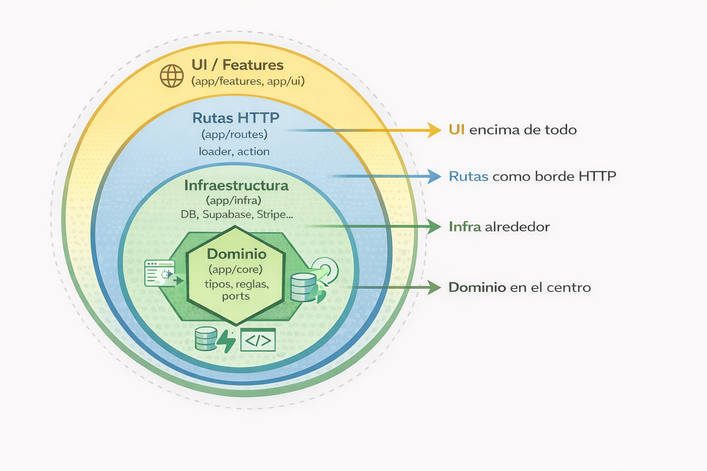

# 🏗️ Arquitectura Hexagonal – FeatureLab

Este documento describe cómo está organizada la app FeatureLab a nivel carpetas, capas y entornos.

Objetivos:

- App fullstack con React Router como “framework backend+frontend”.
- Separar bien dominio / infraestructura / UI.
- Poder cambiar de SQLite local a Supabase/Postgres sin romper la app.
- Tener una base sólida para sumar Stripe, Slack, Redis, AI, etc. más adelante.
- Mantener una estructura entendible para entrevistas (Hexagonal / Clean Architecture).

---

## 🧱 Capas principales

Pensamos la app en 4 capas lógicas:

1. **UI genérica (`app/ui`)**
   - Design system: componentes visuales reutilizables, sin conocimiento de negocio.
   - Ej: `Button`, `Input`, `Card`, `Modal`, `EmptyState`, `PageHeader`.

2. **UI por feature (`app/features`)**
   - Componentes React específicos por feature (Tasks, Flags, Auth, Layout).
   - Hooks de UI (`useTasks`, `useFlags`, `useAuth`, etc.).
   - No contiene lógica de persistencia (no habla directo con DB).

3. **Rutas fullstack (`app/routes`)**
   - Módulos de React Router fullstack:
     - exportan `loader`, `action` y un componente por ruta.
   - Funcionan como “controllers”:
     - traducen HTTP → dominio,
     - llaman a repositorios/servicios,
     - devuelven respuestas (redirect, JSON, errores, etc.).

4. **Dominio (`app/core`)**
   - Reglas de negocio puras, sin React, sin HTTP, sin DB.
   - Contiene:
     - tipos (`Task`, `FeatureFlag`, `User`, etc.),
     - schemas Zod (`taskSchema`, `flagSchema`, `loginSchema`, etc.),
     - interfaces (ports) como `TaskRepository`, `FeatureFlagRepository`, `AuthService`.
   - Esta capa **no importa** ni de UI (`features/ui`) ni de adaptadores de infraestructura.

5. **Infraestructura (`app/infra`)**
   - Implementaciones concretas de los ports del dominio.
   - Contiene:
     - repositorios que hablan con Drizzle/SQLite/Postgres,
     - integraciones con servicios externos (Supabase, Stripe, Slack, AI, Redis).
   - Depende de `core/` (tipos, interfaces), pero no al revés.

---

## 🔄 Reglas de dependencia (en simple)

- `core` **no depende de nadie** (solo de librerías puras como `zod`).
- `infra` puede importar de `core`, pero no de `features` ni de `ui`.
- `features` puede importar de `core` y usar funciones de `infra` vía interfaces/abstracciones.
- `ui` **no puede importar** de `features` ni de `core`: es genérico.
- `routes` puede importar de todos: es el “pegamento” entre HTTP, dominio, infra y UI.

Regla mental:

> Dominio en el centro → Infra alrededor → Rutas como borde HTTP → UI encima de todo.



La arquitectura sigue un enfoque mezcla de **Hexagonal / Clean Architecture**:

- Dominio aislado en `app/core` (reglas de negocio, tipos, puertos/repositorios).
- Infraestructura en `app/infra` (adaptadores a DB, servicios externos).
- UI genérica en `app/ui` (design system).
- UI por feature en `app/features` (React + hooks de UI).
- Rutas fullstack en `app/routes` (capa de entrada HTTP).

El diseño por features + puertos/adaptadores permite que, si en el futuro se quisiera,
se pueda extraer `auth`, `tasks` o `flags` a microservicios separados sin reescribir el dominio.

---

## 🎨 Arquitectura de UI / Frontend

La capa de frontend de FeatureLab se organiza en tres niveles:

1. **Design System genérico** → `app/ui`
2. **UI por feature** → `app/features/*`
3. **Páginas fullstack (ruta + loader/action + UI)** → `app/routes/*`

### 📁 Estructura de UI

```text
app/
  ui/                          # Design system (UI genérica, sin dominio)
    primitives/                # "átomos" base
      Button.tsx               # botón genérico (variants, sizes)
      Input.tsx                # input de texto
      Textarea.tsx             # textarea
      Label.tsx                # label accesible
      Badge.tsx                # pill/badge de estado
      Spinner.tsx              # indicador de carga
      Icon.tsx                 # wrapper para íconos
    surfaces/                  # contenedores visuales
      Card.tsx                 # tarjeta básica
      Panel.tsx                # contenedor de secciones
      PageHeader.tsx           # encabezado de página (título + descripción + actions)
      Section.tsx              # wrapper para bloques dentro de una página
    feedback/                  # feedback al usuario
      Alert.tsx                # mensajes de info/éxito/error
      EmptyState.tsx           # estado vacío (sin datos)
      ErrorMessage.tsx         # mensaje de error de campo/form
    overlay/                   # UI superpuesta
      Modal.tsx                # diálogo modal
      Dropdown.tsx             # menú desplegable
      Popover.tsx              # popover genérico
    form/                      # patrones de formularios
      FormField.tsx            # label + control + error
      FormActions.tsx          # contenedor para botones de submit/cancel

  features/                    # UI específica por feature (usa app/ui)
    layout/
      AppShell.tsx             # layout principal (sidebar + contenido)
      Sidebar.tsx              # navegación lateral
      Topbar.tsx               # barra superior (usuario, tema, etc.)
    auth/
      components/
        LoginForm.tsx          # formulario de login (usa Input, Button, FormField)
        RegisterForm.tsx       # formulario de registro
      hooks/
        useAuth.ts             # lógica de UI para auth (estado, helpers)
    tasks/
      components/
        TaskForm.tsx           # form de creación/edición de task
        TaskList.tsx           # listado de tareas (usa Card, Badge, EmptyState)
        TaskFilters.tsx        # filtros por estado/prioridad (usa Button, Dropdown)
      hooks/
        useTasks.ts            # lógica de UI para tasks (filtros locales, etc.)
    flags/
      components/
        FlagForm.tsx           # form de creación/edición de flag
        FlagList.tsx           # listado de flags (usa Badge, Switch/Button)
      hooks/
        useFlags.ts            # lógica de UI para flags

  routes/                      # páginas fullstack (UI + loader + action)
    home.tsx                   # /      – dashboard simple
    tasks.tsx                  # /tasks – usa <TaskForm />, <TaskList />, etc.
    flags.tsx                  # /flags – usa <FlagForm />, <FlagList />
    auth.login.tsx             # /login  – página que renderiza <LoginForm />
    auth.register.tsx          # /register – renderiza <RegisterForm />
    profile.tsx                # /profile – datos del usuario + logout
````

### 🔍 Responsabilidades por nivel (UI)

* `app/ui/*` (**Design System**)

  * Componentes:

    * No conocen `Task`, `FeatureFlag`, `User`, etc.
    * Solo trabajan con props genéricas (`variant`, `size`, `state`, `onClick`…).
  * Implementados con:

    * TailwindCSS.
    * Radix UI / shadcn/ui debajo cuando aporte accesibilidad/comportamiento.

* `app/features/*` (**UI por feature**)

  * Componentes:

    * Sí conocen conceptos de dominio: Task, FeatureFlag, Auth.
    * Componen el design system (`app/ui`) para construir pantallas ricas.
  * Ejemplos:

    * `TaskForm` usa `FormField`, `Input`, `Textarea`, `Button`.
    * `TaskList` usa `Card`, `Badge`, `EmptyState`.
    * `FlagList` usa `Card`, `Badge`, `Switch/Button`.

* `app/features/layout/*`

  * Define el **layout general** de la app:

    * sidebar, topbar, shell responsive, etc.
  * Usa componentes de `app/ui/surfaces` y `app/ui/overlay`.

* `app/routes/*` (**páginas fullstack**)

  * Conectan:

    * UI de `features/*`,
    * dominio (`core/*`),
    * infraestructura (`infra/*`).
  * Responsabilidades:

    * `loader` → obtiene datos (ej: listar tasks desde `TaskRepository`).
    * `action` → procesa forms (ej: crear task, login).
    * Componente de página → renderiza layout + componentes de feature.

### 🎯 Reglas simples de uso (UI)

* **Features → UI**:

  * Todas las pantallas y componentes de feature deberían usar `app/ui` cuando se pueda.
  * No redefinir botones, inputs, cards “a mano” en cada feature.

* **UI → Features**:

  * `app/ui` **no puede importar** nada de `app/features` ni de dominio (`app/core`).
  * Se mantiene 100% genérico y reutilizable.

* **Routes → UI**:

  * Las rutas deberían componer `AppShell` + componentes de feature + design system.
  * Se evita tirar Tailwind crudo directamente en todos lados (salvo cosas mínimas).

---

## 📁 Estructura de carpetas – MVP v0.1 (completa)

```text
featurelab/
├── app/                            # App fullstack (React Router framework)
│   ├── core/                       # Dominio: tipos, reglas, puertos
│   │   ├── auth/                   # User, login/register, schemas
│   │   │   ├── auth.types.ts       # User, UserId, etc.
│   │   │   ├── auth.schema.ts      # loginSchema, registerSchema (Zod)
│   │   │   └── auth.port.ts        # AuthService, interfaces de auth (v0.2+)
│   │   ├── tasks/                  # Task, estados, prioridades, reglas
│   │   │   ├── task.types.ts       # Task, TaskStatus, TaskPriority
│   │   │   ├── task.schema.ts      # taskCreateSchema, taskUpdateSchema
│   │   │   └── task.port.ts        # TaskRepository (list, create, update)
│   │   ├── flags/                  # Feature flags, entornos
│   │   │   ├── flag.types.ts       # FeatureFlag, Environment
│   │   │   ├── flag.schema.ts      # flagCreateSchema, flagUpdateSchema
│   │   │   └── flag.port.ts        # FeatureFlagRepository
│   │   └── common/                 # Tipos/utilidades compartidas (IDs, Result, etc.)
│   │
│   ├── infra/                      # Infraestructura real (DB, servicios externos)
│   │   ├── db/                     # Drizzle + conexiones
│   │   │   ├── schema.ts           # Tablas users, tasks, feature_flags (v0.1: todas aquí)
│   │   │   ├── client.sqlite.ts    # Cliente Drizzle + SQLite (local dev)
│   │   │   └── client.supabase.ts  # Cliente Drizzle + Supabase/Postgres (cloud, v0.2+)
│   │   ├── auth/                   # Repo de usuarios + helpers de password
│   │   │   └── auth.repository.drizzle.ts
│   │   ├── tasks/                  # Implementaciones de TaskRepository
│   │   │   ├── task.repository.sqlite.ts   # SQLite (modo local)
│   │   │   ├── task.repository.supabase.ts # Supabase/Postgres (modo cloud, v0.2+)
│   │   │   └── task.repository.ts          # Exporta el repo según env (DB_PROVIDER)
│   │   ├── flags/                  # Implementaciones de FeatureFlagRepository
│   │   │   ├── flag.repository.sqlite.ts
│   │   │   ├── flag.repository.supabase.ts
│   │   │   └── flag.repository.ts
│   │   # v0.2+ (futuro):
│   │   ├── redis/                  # Cache, sesiones, pub/sub
│   │   ├── stripe/                 # Integración Stripe (billing)
│   │   ├── slack/                  # Integración Slack (notificaciones)
│   │   └── ai/                     # Integración Gemini u otros modelos
│   │
│   ├── ui/                         # Design system (UI genérica, sin dominio)
│   │   ├── primitives/
│   │   │   ├── Button.tsx
│   │   │   ├── Input.tsx
│   │   │   ├── Textarea.tsx
│   │   │   ├── Label.tsx
│   │   │   ├── Badge.tsx
│   │   │   ├── Spinner.tsx
│   │   │   └── Icon.tsx
│   │   ├── surfaces/
│   │   │   ├── Card.tsx
│   │   │   ├── Panel.tsx
│   │   │   ├── PageHeader.tsx
│   │   │   └── Section.tsx
│   │   ├── feedback/
│   │   │   ├── Alert.tsx
│   │   │   ├── EmptyState.tsx
│   │   │   └── ErrorMessage.tsx
│   │   ├── overlay/
│   │   │   ├── Modal.tsx
│   │   │   ├── Dropdown.tsx
│   │   │   └── Popover.tsx
│   │   └── form/
│   │       ├── FormField.tsx
│   │       └── FormActions.tsx
│   │
│   ├── features/                   # UI/UX específica por feature (usa app/ui)
│   │   ├── layout/                 # Layout general: sidebar, navbar, theme toggle
│   │   │   ├── AppShell.tsx
│   │   │   └── Sidebar.tsx
│   │   ├── auth/                   # LoginForm, RegisterForm, ProfileView
│   │   │   ├── components/
│   │   │   │   ├── LoginForm.tsx
│   │   │   │   └── RegisterForm.tsx
│   │   │   └── hooks/
│   │   │       └── useAuth.ts
│   │   ├── tasks/                  # TaskForm, TaskList, TaskFilters
│   │   │   ├── components/
│   │   │   │   ├── TaskForm.tsx
│   │   │   │   ├── TaskList.tsx
│   │   │   │   └── TaskFilters.tsx
│   │   │   └── hooks/
│   │   │       └── useTasks.ts
│   │   ├── flags/                  # FlagForm, FlagList, FlagToggle
│   │   │   ├── components/
│   │   │   │   ├── FlagForm.tsx
│   │   │   │   └── FlagList.tsx
│   │   │   └── hooks/
│   │   │       └── useFlags.ts
│   │
│   ├── routes/                     # Rutas fullstack (loader + action + componente)
│   │   ├── home.tsx                # Ruta / (dashboard simple)
│   │   ├── tasks.tsx               # Ruta /tasks (usa TaskRepository + UI de tasks)
│   │   ├── flags.tsx               # Ruta /flags (usa FeatureFlagRepository + UI de flags)
│   │   ├── auth.login.tsx          # Ruta /login (renderiza LoginForm)
│   │   ├── auth.register.tsx       # Ruta /register (renderiza RegisterForm)
│   │   ├── profile.tsx             # Ruta /profile (datos del usuario + logout)
│   │   └── api/                    # (v0.2+) Rutas tipo API-only (JSON, webhooks, etc.)
│   │       ├── health.tsx          # /api/health (healthcheck JSON)
│   │       ├── tasks.tsx           # /api/tasks (ejemplo API JSON)
│   │       └── webhooks.stripe.tsx # /api/webhooks/stripe (webhook Stripe)
│   │
│   ├── root.tsx                    # Layout raíz, ErrorBoundary, <Outlet />
│   ├── routes.ts                   # Mapa de rutas (RouteConfig de React Router)
│   ├── app.css                     # Estilos globales (fuente Inter, layout base)
│   └── tailwind.css                # Entrada de Tailwind (@import "tailwindcss")
│
├── public/                         # Assets estáticos (favicon, og images, etc.)
│
├── docs/                           # Documentación
│   ├── ARCHITECTURE.md             # Este archivo
│   ├── MVP.md                      # Definición de MVP y fases
│   └── DOCS.md                     # Links a documentación externa de stack
│
├── drizzle.config.ts               # Configuración de Drizzle ORM
├── vitest.config.ts                # Config Vitest (tests v0.2+)
├── tailwind.config.ts              # Config Tailwind
├── eslint.config.mjs               # Config ESLint
├── .prettierrc                     # Config Prettier
├── package.json                    # Scripts + deps
└── README.md                       # Resumen del proyecto + cómo correrlo
```

---

## 📌 Rutas API (v0.2+)

* v0.1: solo rutas página (UI + loader/action).
* v0.2+: agregar 1–2 rutas tipo API-only en `app/routes/api/*`:

  * `/api/health` (healthcheck JSON).
  * `/api/webhooks/stripe` (ejemplo de integración externa).
  * (opcional) `/api/flags/:key` para exponer feature flags a otros clientes.

---

## 🌍 Estrategia de datos y entornos tipo "prod → prepro → local"

### 🗄️ Bases de datos

* **Prod**: Supabase Postgres (datos reales).
* **Prepro/Staging**: copia anonimizada de prod

  * Job (cron/CI) que:

    * hace dump de la DB de prod,
    * anonimiza datos sensibles (emails, nombres, etc.),
    * restaura el dump en la base de prepro/staging.
* **Local**:

  * Opción A: React Router dev apuntando a la DB de prepro/staging (como en la empresa anterior).
  * Opción B: SQLite local (`featurelab.db`) + seeds (`npm run seed`) para datos de prueba rápidos y seguros.

### ☁️ App en la nube (Vercel)

* **Production**:

  * Deploy de la rama `main`.
  * URL tipo: `https://featurelab.vercel.app`.
  * Env vars apuntan a la DB de **prod**:

    * `DB_PROVIDER=supabase`
    * `SUPABASE_DB_URL=postgres://...prod...`
* **Prepro / Staging**:

  * Deploys de:

    * una rama fija `staging`, **o**
    * preview deployments de ramas de feature/release.
  * URLs tipo: `https://featurelab-git-staging-....vercel.app`.
  * Env vars apuntan a la DB de **prepro/staging**:

    * `DB_PROVIDER=supabase`
    * `SUPABASE_DB_URL=postgres://...staging...`
* **Local (development)**:

  * `npm run dev` en la máquina local.
  * Env vars pueden apuntar a:

    * `DB_PROVIDER=sqlite` (SQLite local para desarrollo rápido), **o**
    * `DB_PROVIDER=supabase` + `SUPABASE_DB_URL=postgres://...dev/prepro...` para trabajar contra una DB remota similar a prod.